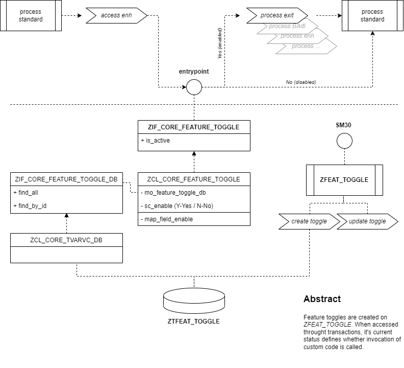

# abap-feature-toggle
Feature toggle for ABAP _(aka Feature Flags)_

A software engineering technique that turns system functionalities on and off during runtime, with no downtimes, and deploying new codes.

- Validate feature functionality
- Modify system behaviour without disruptive changes or stoppers
- Minimize risks during development/implementation phase
- System outage
- Helps developers and testers to keep the development flow uninterrupted

## Diagram

<p align="center">

</p>

## Instantiating

- create an entry on view `ZFEAT_TOGGLE`;
- activate/deactivate the created toggle;
- use snippet below to instantiate/implement the feature toggle.

```abap
DATA gc_feature_toggle TYPE zcore_feature_toggle.
DATA go_feature_toggle TYPE REF TO zif_core_feature_toggle.
DATA gv_is_active      TYPE c.

CREATE OBJECT go_feature_toggle TYPE zcl_core_feature_toggle.

gv_is_active = go_feature_toggle->is_active( gc_feature_toggle ).

IF gv_is_active = abap_true
  ...
ENDIF.
```

## Examples and documentation

Main class implementation is `ZCL_CORE_FEATURE_TOGGLE`.

Find use methods below aside of its documentation.

- [**is_active**](#is_active)

### is_active

Check whether the feature toggle is activated. The return is a boolean value of the current status of a given feature toggle.

- _input_: 
  - iv_feature _TYPE (zcore_feature_toggle)_
- _result_: TYPE abap_bool

Example: `Z_TEST_FEATURE_TOGGLE`. 

See source code [**here**](src/z_test_feature_toggle.prog.abap).
